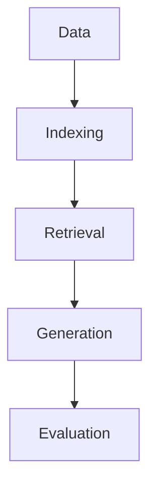

# RAG Studio

A powerful web application for designing and implementing RAG (Retrieval-Augmented Generation) solutions with state-of-the-art techniques.

<!--
====================
 TABLE OF CONTENTS
====================
A table of contents helps users quickly navigate large READMEs.
-->
## Table of Contents
- [Features](#features)
- [Screenshots](#screenshots)
- [Getting Started](#getting-started)
- [Usage](#usage)
- [Project Structure](#project-structure)
- [Configuration](#configuration)
- [Architecture](#architecture)
- [Contributing](#contributing)
- [Testing](#testing)
- [Evaluation & Benchmarks](#evaluation--benchmarks)
- [References](#references)
- [License](#license)
- [Contact & Acknowledgements](#contact--acknowledgements)

<!--
====================
 FEATURES
====================
List the main features of your project. Use emojis for clarity and visual appeal.
-->
## Features
- 📂 Data Ingestion & Processing
- 🗂️ Indexing & Storage
- 🔍 Retrieval & Reranking
- 💭 Generation & Prompting
- 🤖 Model Management
- 📊 Evaluation & Analytics

<!--
====================
 SCREENSHOTS / DEMO
====================
Show what your app looks like. Replace the placeholder with your own images or GIFs.
-->
## Screenshots
<!--


-->

<!--
====================
 GETTING STARTED
====================
Explain prerequisites, installation, and quickstart. This helps new users get up and running fast.
-->
## Getting Started

### Prerequisites
- Python 3.8+
- OS: Windows, MacOS, or Linux
- (Optional) [Streamlit](https://streamlit.io/) for UI

### Installation
```bash
pip install -r requirements.txt
```

### Quickstart
```bash
streamlit run app.py
```

<!--
====================
 USAGE
====================
Step-by-step guide for using the app. Add more details as needed.
-->
## Usage
1. Start with the Data section to configure your data sources
2. Move to Indexing & Storage to set up your vector store
3. Configure Retrieval & Reranking parameters
4. Set up your prompting strategy
5. Choose and configure your models
6. Use the Evaluation section to measure performance

<!--
====================
 PROJECT STRUCTURE
====================
Briefly explain the main files and folders. This helps users understand where to look for things.
-->
## Project Structure
```
rag_studio/
  app.py                # Main Streamlit app
  backend.py            # Backend logic for RAG pipeline
  data/                 # Data, embeddings, evaluation sets, vector stores
  prompts/              # Prompt templates
  requirements.txt      # Python dependencies
  README.md             # This file
```

<!--
====================
 CONFIGURATION
====================
Explain how to configure models, data sources, and environment variables.
-->
## Configuration
- Edit `app.py` and `backend.py` to set model parameters, data paths, and other options.
- Place your data and embeddings in the `data/` directory.
- (Optional) Use environment variables for API keys and secrets.

<!--
====================
 ARCHITECTURE
====================
Describe the system design. Add a diagram if possible.
-->
## Architecture
The application follows a modular design with separate sections for each major component of the RAG pipeline. The UI is built with Streamlit for a clean, responsive interface.

<!--
You can add a diagram here using Mermaid or an image:

-->

<!--
====================
 CONTRIBUTING
====================
Encourage others to contribute and explain how.
-->
## Contributing
Contributions are welcome! Please open issues or pull requests. Follow PEP8 style and write clear commit messages.

<!--
====================
 TESTING
====================
Explain how to run tests and what frameworks are used.
-->
## Testing
<!--
Add instructions for running tests, e.g.:
pytest tests/
-->

<!--
====================
 EVALUATION & BENCHMARKS
====================
Show how to evaluate the system and any benchmark results.
-->
## Evaluation & Benchmarks
- Use the Evaluation section in the app to measure performance.
- Results are saved in `data/evaluation/results/`.

<!--
====================
 REFERENCES
====================
Cite papers, tutorials, or external resources.
-->
## References
- [Chunking knowledge tutorial](https://github.com/FullStackRetrieval-com/RetrievalTutorials/blob/main/tutorials/LevelsOfTextSplitting/5_Levels_Of_Text_Splitting.ipynb)
- (Add more references here)

<!--
====================
 LICENSE
====================
State the license for your project.
-->
## License
<!--
Specify your license, e.g. MIT, Apache 2.0, etc.
-->

<!--
====================
 CONTACT & ACKNOWLEDGEMENTS
====================
How to reach the authors and credits for inspiration or dependencies.
-->
## Contact & Acknowledgements
- Author: [Your Name](mailto:your.email@example.com)
- Thanks to the open-source community and contributors.